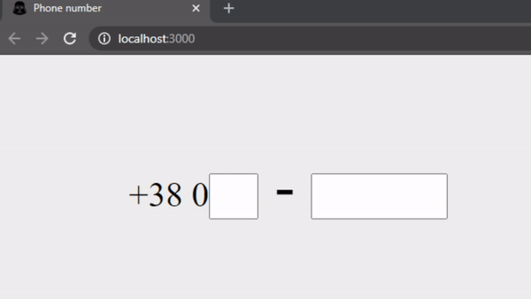

Mobile operators:
  - `Kyivstar`: 67, 68, 96, 97, 98
  - `Vodafone`: 50, 66, 95, 99
  - `Lifecell`: 63, 73, 93
  - `3mob`: 91
  - `People.net`: 92
  - `intertelecom`: 89, 94
  - `Unknown`: other 2 digit numbers
